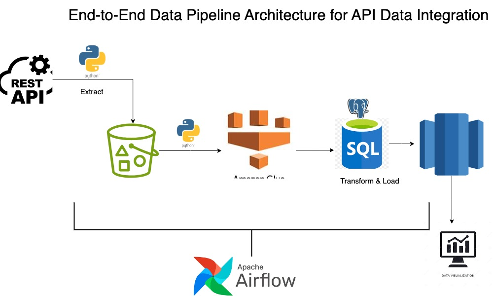

# api_hackathon

# api_project


## Project Overview


This project demonstrates the extraction of datasets from an API and showcases the robust pipeline flow involved in handling the data. It highlights the process from data retrieval to transformation, providing a comprehensive view of how to manage and utilize API-sourced data effectively


### Data Extraction
The data is extracted from the REST Countries API. The extraction process involves making a GET request to the API and processing the JSON response to extract the necessary fields.

### Data Transformation
After extracting the data, it is transformed and cleaned to ensure it is in a suitable format for analysis. This involves parsing nested JSON structures, handling missing values, and converting data types as needed.

### Data Storage
The processed data is stored in an Amazon S3 bucket in Parquet format. Using AWS S3 allows for scalable and cost-effective storage of large datasets, with Parquet chosen for its efficiency in both storage and query performance.

### Tools and Technologies Used

- **Python**: The primary programming language used for data extraction and transformation.
- **Pandas**: A powerful data manipulation library used for cleaning and transforming the data.
- **Requests**: A simple HTTP library for making API calls to the REST Countries API.
- **AWS S3**: Amazon's scalable object storage service is used to store the transformed data.
- **AWS SDK for Python (boto3)**: Used to interact with AWS services, particularly for uploading data to S3.
- **AWS Data Wrangler (awswrangler)**: A Python library that extends Pandas to interact with AWS data services, specifically for writing data to S3 in Parquet format.
- **Amazon Redshift**: A fully managed data warehouse service used for querying and analyzing large datasets.
- **Redshift Spectrum**: A feature that allows querying data stored in S3 without loading it into Redshift, enabling seamless integration with the Redshift cluster.
- **Terraform**: An infrastructure as code tool used to define and provision cloud infrastructure.
- **GitHub**: Version control and collaboration platform used to manage the project's codebase.
- **DBeaver**: A database management tool used for connecting to the Redshift cluster, allowing for easy exploration and querying of the data in Redshift.

### Dependencies

Here are the key dependencies required for this project:

```plaintext
- python
- pandas
- requests
- boto3
- awswrangler
```

### Virtual Environment

A virtual environment named `my_venv` was created to manage the project dependencies. This helps to isolate the project's dependencies from the system-wide packages, ensuring a consistent and reproducible development environment.

### Installation

To get started with this project, you'll need to create the virtual environment and install the necessary dependencies. You can do this using the following commands:

```sh
# Create a virtual environment
python -m venv my_ve

# Activate the virtual environment
# On macOS source my_venv/bin/activate
# On Windows use `my_venv\Scripts\activate`

# Install the dependencies
pip install pandas requests boto3 awswrangler
```

### Usage

## Project Files and Screenshots

Python Code: The complete Python code used for data extraction, transformation, and storage is available [here](airflow_files)! This script handles the entire data pipeline process.

DBeaver Screenshots: To provide visual insights into how the data is managed and queried in DBeaver, you can view the screenshots [here](SQL_Syntax)! These screenshots demonstrate the interface

Terraform Configuration: The Terraform configurations used to set up the cloud infrastructure are available [here](cloud_infras)! This includes the setup of S3 buckets, Redshift clusters, and any other required infrastructure components.

### Conclusion

This project illustrates the end-to-end process of handling data from an API, from extraction and transformation to storage in a cloud environment. By leveraging powerful tools and libraries, the project ensures that the data pipeline is robust and scalable, ready to handle real-world data challenges.
